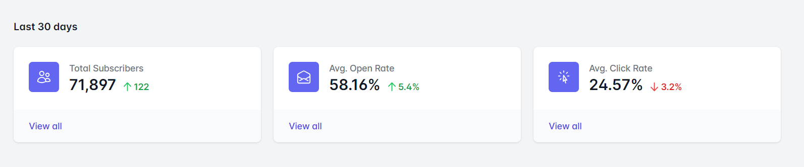

# Construct Stats Card

In this assignment you will be required to create a stats card attached below using tailwind CSS.

> NOTE: Do all your work in the `index.html` file herein.

Before you begin, open a new branch named `v1/attempt`

Once done, `commit` your work with a proper message then `push` it.